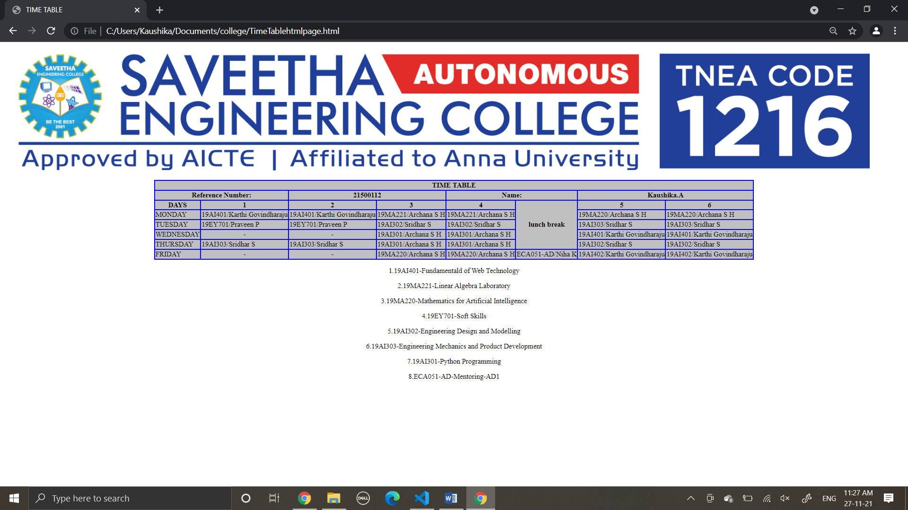

# Experiment_Time_Table

## AIM
To Write a html webpage page to display your timetable.

# ALGORITHM
### STEP 1
create a simple table using table tag
### STEP 2
Add header row using th tag
### STEP 3
Add your timetable
### STEP 4
Execute the program

# CODE
~~~
<!DOCTYPE html>
<html>
   <head>
      
    </head>
    <head>
        <title>TIME TABLE</title>
    </head>
	
   <body>
      <table border = "1" cellspacing="1" bordercolor="blue" bgcolor="silver" align="center">
         <tr>
            <th colspan="10">TIME TABLE</th>
         </tr>

         <tr>
            <th colspan="2">Reference Number:</th>
            <th colspan="2">21500112</th>
            <th colspan="2">Name:</th>
            <th colspan="2">Kaushika.A</th>
         </tr>
         
         <tr>
            <th>DAYS</th>
            <th>1</th>
            <th>2</th>
            <th>3</th>
            <th>4</th>
            <th rowspan="5">lunch break</th>
            <th>5</th>
            <th>6</th>
         </tr>

          <tr>
             <td>MONDAY</td>
             <td>19AI401/Karthi Govindharaju</td>
             <td>19AI401/Karthi Govindharaju</td>
             <td>19MA221/Archana S H</td>
             <td>19MA221/Archana S H</td>
             <td>19MA220/Archana S H</td>
             <td>19MA220/Archana S H</td>
         </tr>

         <tr>
             <td>TUESDAY</td>
             <td>19EY701/Praveen P</td>
             <td>19EY701/Praveen P</td>
             <td>19AI302/Sridhar S</td>
             <td>19AI302/Sridhar S</td>
             <td>19AI303/Sridhar S</td>
             <td>19AI303/Sridhar S</td>
         </tr>

          <tr>
             <td>WEDNESDAY</td>
             <td align="center">-</td>
             <td align="center">-</td>
             <td>19AI301/Archana S H</td>
             <td>19AI301/Archana S H</td>
             <td>19AI401/Karthi Govindharaju</td>
             <td>19AI401/Karthi Govindharaju</td>
         </tr>

          <tr>
             <td>THURSDAY</td>
             <td>19AI303/Sridhar S</td>
             <td>19AI303/Sridhar S</td>
             <td>19AI301/Archana S H</td>
             <td>19AI301/Archana S H</td>
             <td>19AI302/Sridhar S</td>
             <td>19AI302/Sridhar S</td>
         </tr>

           <tr>
             <td>FRIDAY</td>
             <td align="center">-</td>
             <td align="center">-</td>
             <td>19MA220/Archana S H</td>
             <td>19MA220/Archana S H</td>
             <td>ECA051-AD/Niha K</td>
             <td>19AI402/Karthi Govindharaju</td>
             <td>19AI402/Karthi Govindharaju</td>
         </tr>
  
         
      </table>
      
      
1.19AI401-Fundamentald of Web Technology

      
2.19MA221-Linear Algebra Laboratory

      
3.19MA220-Mathematics for Artificial Intelligence

      
4.19EY701-Soft Skills

      
5.19AI302-Engineering Design and Modelling

      
6.19AI303-Engineering Mechanics and Product  Development

      
7.19AI301-Python Programming

      
8.ECA051-AD-Mentoring-AD1

   </body>
</html>
~~~
# OUPUT

# RESULT
Thus, a html webpage is created to display the timetable.
